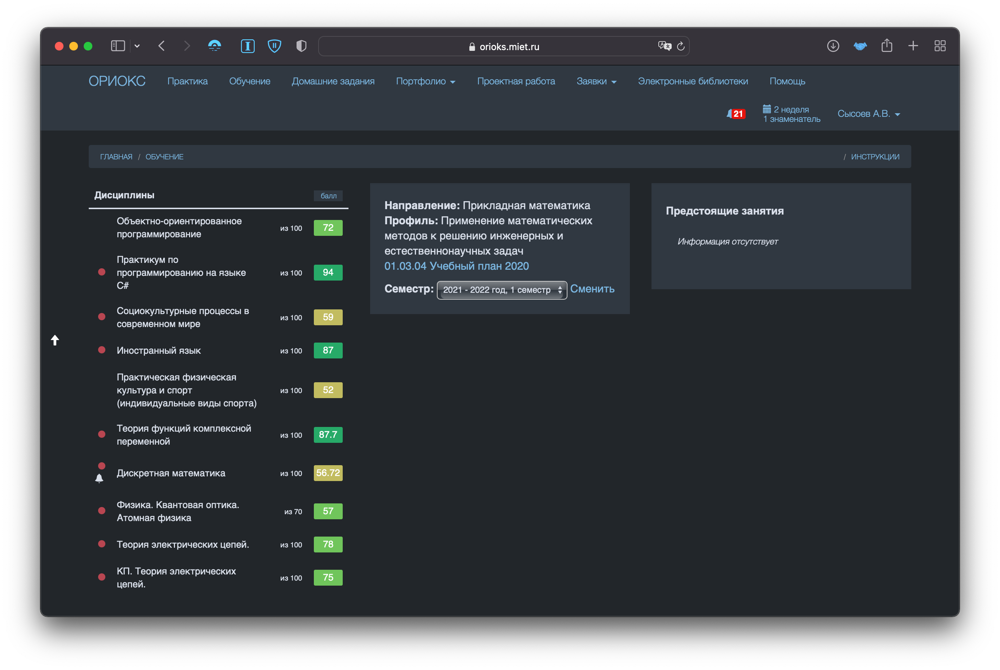

# NightlyOrioks

Темное оформление для платформы ОРИОКС

**Автор и версия для Chrome:** Матвей Верховцев

**Оболочка для Safari:** Сысоев Артем

## Основные функции
- делает ОРИОКС приятным для глазок в темное время дня
- синхронизуется с системной темой

## Системные требования 
- iOS/iPadOS 15.0+
- macOS 11.0+

